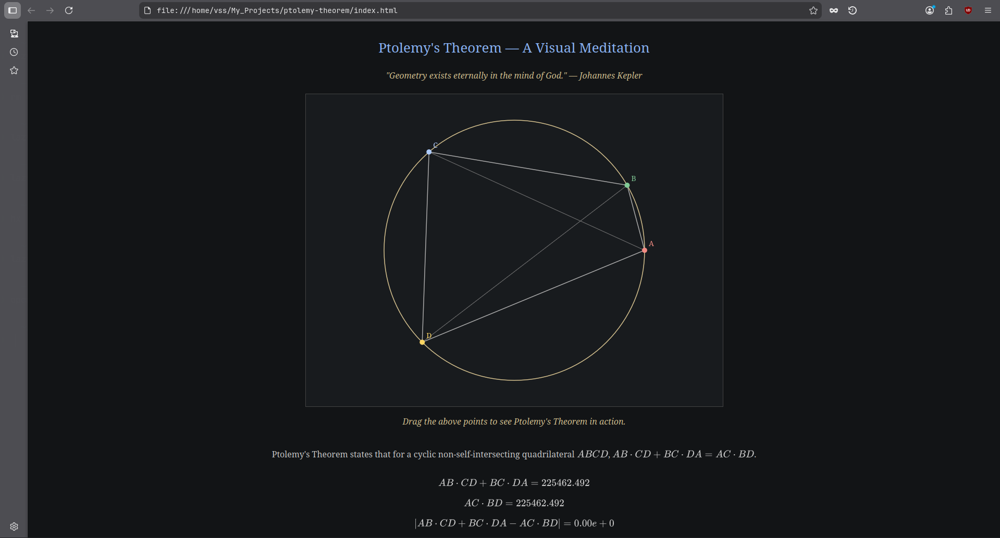

# Ptolemy’s Theorem — A Visual Meditation

An interactive canvas-based visualization of Ptolemy’s Theorem for cyclic quadrilaterals.

Four points lie on a fixed circle and can be dragged along it. As the quadrilateral changes,
the identity

$\mathrm{AB \cdot CD + BC \cdot DA = AC \cdot BD}$

is verified numerically in real time.

This project prioritizes clarity, geometry-first design, and restraint over animation or effects.

## Status
- Geometry and interaction complete
- Numerical verification complete
- Visual styling complete
- Math rendering (KaTeX / MathJax) complete

## What is Ptolemy's Theorem?

Arount 150-200 CE, Claudius Ptolomeus (known to us as Ptolemy) wrote the Almagest,
a text on the Geocentric model of the solar system. Within it, he used the above table
to create a table of chords, which he would use for his astronomical work.

This project is made to show Ptolemy's Theorem in action.
